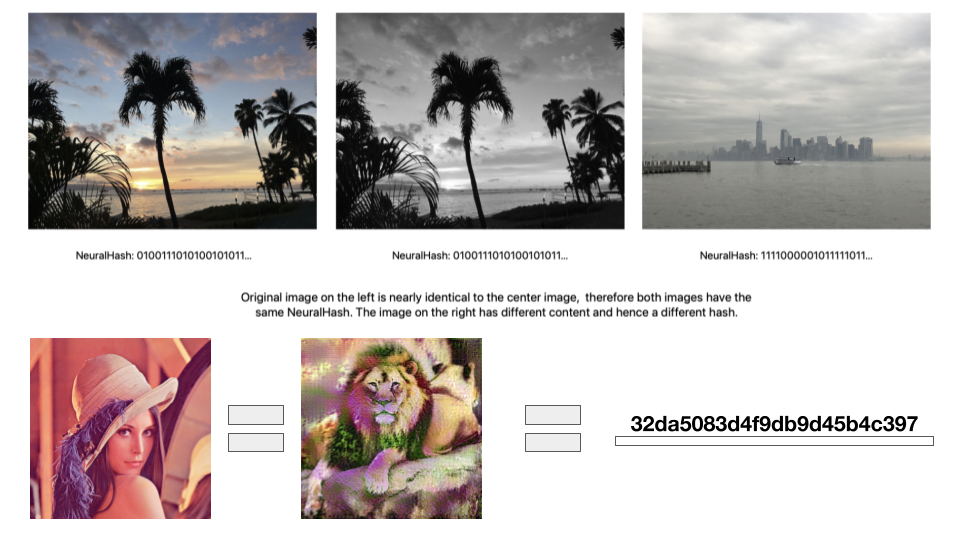

# LenaHashTM
> **NOTE:** Vietnamese only.

Mấy ngày gần đây giới mộ điệu học máy xôn xao về Apple CSAM và cụ thể hơn là NeuralHash. Đại loại là Apple sẽ trích xuất các bức ảnh dưới dạng 1 hash tạo ra bởi neural network (cụ thể trong bản demo là MobileNetV3) để phát hiện các bức hình gần trùng lặp. Chi tiết kỹ thuật ở đây [1]

Thực ra việc quét ảnh/photos trên các dịch vụ cloud không mới đối với các Big Tech như Google, Facebook, Microsoft. Điểm khác biệt là Apple xử lý việc so trùng này trên thiết bị người dùng bằng cách nạp vào 1 bộ cơ sở dữ liệu cần so khớp được mã hoá, để tạo ra các voucher gửi lên iCloud. Nhiều người lo lắng về khả năng mở rộng truy quét trên các loại dữ liệu khác như văn bản, tin nhắn khi có các yêu cầu từ Big Bros khác.

Một số nhóm kỹ thuật đã tìm ra được các phiên bản thử nghiệm và khai thác được việc tạo ra các hash giống nhau từ những bức hình hoàn toàn trông có vẻ khác nhau. Ví dụ như Lena và Lion đều cùng mã hash 32da5083d4f9db9d45b4c397. Các bạn có thể thử nghiệm dựa trên các repo này.[2]

Thực ra việc này không gây nguy hại nhiều cho con người, nhưng hệ thống CSAM detection sẽ bị quá tải bởi false alarm.

### References

1. 
2. 

